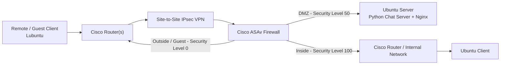

# Distributed Systems: VPN, Routing, Firewall, and Chat Server Case Study

> **Academic project case study**  
> This repository reconstructs the technical scope of a university Distributed Systems project.  
> The original GNS3 project files, device configurations, screenshots, and Python source code are no longer available, so this repository focuses on the **architecture, technologies, system design, and learning outcomes** rather than presenting a reproducible source release.

## Overview

This project explored how multiple networking and application-layer components can work together in a distributed environment.

The system combined:

- Cisco routers in a multi-network topology
- Cisco ASAv as a firewall and security boundary
- OSPF for dynamic routing
- VLSM-based IP addressing derived from the `172.25.2.0/16` network
- Site-to-site IPsec VPN connectivity
- NAT and segmented security zones
- Ubuntu Server and Lubuntu/Ubuntu clients
- A Python socket-based chat server
- Nginx with HTTPS using a self-signed certificate

The goal was to connect separate network segments securely while allowing application services to communicate across the topology.

---

## System Architecture

The project was built and tested in **GNS3** using Cisco networking devices and Linux virtual machines.

### Simplified Logical View



> The diagram is intentionally simplified to communicate the architecture at portfolio level rather than reproduce the original GNS3 topology one-to-one.

---

## Network Design

The original network used:

```text
172.25.2.0/16
```

The address space was divided into smaller subnets using **VLSM (Variable Length Subnet Masking)** to support the different network segments in the topology.

### Routing

**OSPF** was used for dynamic routing between participating Cisco routers.

This allowed routes to be exchanged automatically instead of relying entirely on static routes.

### Security Segmentation

The Cisco ASAv separated the network into security zones, including:

- **Outside / Guest:** security level `0`
- **DMZ:** security level `50`
- **Inside:** security level `100`

The Ubuntu Server was placed in the DMZ, while the protected internal client network was placed behind the higher-trust inside interface.

### VPN

A **site-to-site IPsec VPN** was configured to provide encrypted communication between separated network segments.

The project also involved **NAT** rules to control address translation and traffic flow across the firewall.

---

## Application Layer

Networking was not the only focus of the project. The topology also hosted application services.

### Python Chat Server

A Python socket-based chat application was used to demonstrate communication between clients across the configured network.

The application layer helped verify that:

1. Routing was functioning.
2. Firewall rules allowed the intended traffic.
3. NAT and VPN configuration did not prevent application communication.
4. Clients could exchange messages across separate network segments.

### Nginx and HTTPS

An Ubuntu Server also hosted **Nginx**.

HTTPS was configured using a **self-signed certificate** to introduce secure web-service deployment inside the simulated distributed environment.

---

## Technologies

| Area | Technologies |
|---|---|
| Network Simulation | GNS3 |
| Routing | Cisco IOS, OSPF |
| Firewall | Cisco ASAv |
| VPN | Site-to-Site IPsec |
| Addressing | IPv4, VLSM |
| Network Services | NAT |
| Server OS | Ubuntu Server |
| Client OS | Ubuntu / Lubuntu |
| Application | Python socket programming |
| Web Server | Nginx |
| Security | HTTPS, self-signed certificate |

---

## What the Project Demonstrated

This project connected several concepts that are often learned separately:

- subnet design and routing
- firewall security zones
- VPN tunneling
- NAT
- Linux server configuration
- socket-based client/server communication
- HTTPS deployment

Rather than treating networking and software as independent layers, the project showed how an application depends on the underlying network path, routing decisions, firewall policies, and service configuration.

---

## Troubleshooting Approach

The project required testing the system layer by layer.

A typical troubleshooting flow included:

1. Verify device/interface addressing.
2. Confirm local connectivity using `ping`.
3. Check OSPF neighbor relationships and learned routes.
4. Validate firewall access rules.
5. Verify NAT behavior.
6. Confirm VPN connectivity.
7. Test Linux server reachability.
8. Test the Python chat service.
9. Verify Nginx/HTTPS access.

This layered approach helped isolate whether a failure came from routing, security policy, VPN configuration, or the application itself.

---

## Key Learning Outcomes

- Designing subnet allocations with VLSM
- Configuring dynamic routing with OSPF
- Understanding Cisco ASAv security levels and network segmentation
- Working with NAT and site-to-site VPN concepts
- Deploying Linux-based services in a DMZ
- Connecting application-layer testing with network troubleshooting
- Understanding how distributed applications depend on infrastructure configuration

---

## Repository Scope

This repository is a **portfolio case study**, not the original project source archive.

The original:

- GNS3 topology
- Cisco router / ASAv configuration files
- Python chat source code
- screenshots
- detailed project report

are no longer available.

For that reason, no reconstructed code or configuration is presented as the original implementation. The purpose of this repository is to document the technical architecture and the concepts implemented during the project as accurately and transparently as possible.

---

## Academic Context

**Course:** Distributed Systems  
**Program:** B.Sc. Computer Science, Universitas Tarumanagara  
**Year:** 2025

---

## Author

**Ellen Elvira**  
Computer Science Student  
GitHub: [github.com/nallievira](https://github.com/nallievira)
